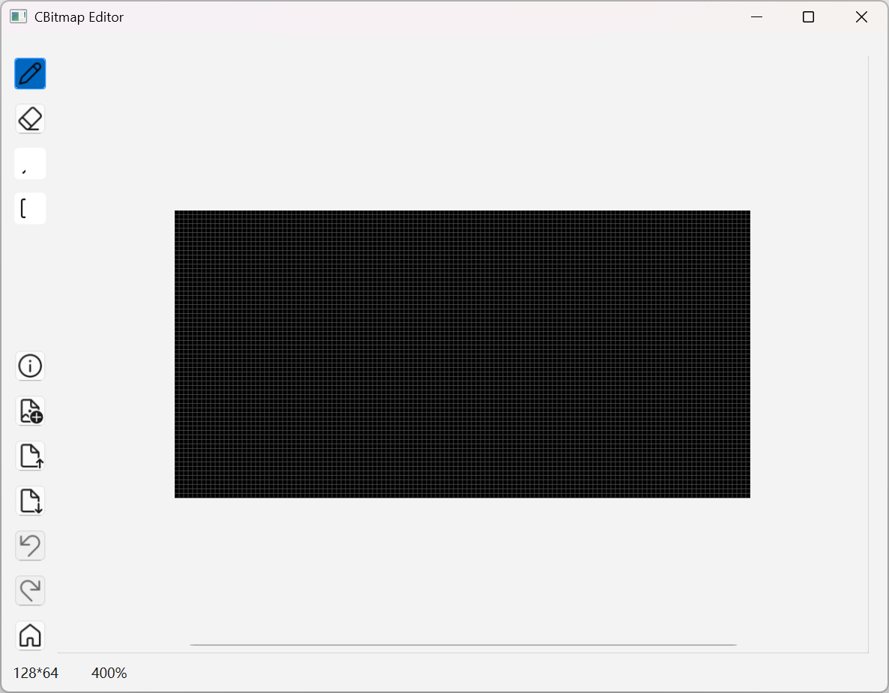

# CBitmap 使用指南

本应用是一个用于生成单色bitmap数组的工具，主要用于嵌入式开发中显示屏的图像显示。


# 界面


#### 左上角四个按钮由上至下依此为：
1. 笔
2. 橡皮擦
3. 绘制类型（自由、直线、长方形、圆形）
4. 填充类型（空心、实心）

#### 左下角七个按钮由上至下依次为：
1. 画布信息/设置 - 这个对话框用于调整视觉属性、画布尺寸、迁移尺寸等功能
2. 从其他图片导入 - 这个对话框用于从其他图片导入图像，支持bmp、jpg、png等格式，并支持二值化过滤选项
3. 从代码导入 - 这个对话框用于从 bitmap 数组代码导入图像。
4. 导出到代码 - 这个对话框用于将当前图像导出为 bitmap 数组代码。
5. 撤销
6. 重做
7. 重设视点/缩放

#### 中心区域
中心区域为画布区域，可以在此进行绘图。

支持的操作键有：
- 滚轮：垂直滚动
- Shift + 滚轮：水平滚动
- Ctrl + 滚轮：缩放（以光标为中心）
- Alt + 滚轮：水平滚动（是的，和 Shift 没有区别，因为这个是Qt自带的）
- 左键：绘制/擦除
- Shift + 左键：特殊吸附绘制/擦除（部分工具支持）


## 导入/导出（代码）

本工具支持代码格式如下：

```cpp
const uint8_t frame_16x16[] = {
    0x00, 0x00, 0x05, 0x40, 0x13, 0xd0, 0x0c, 0x34, 0x38, 0x18, 0x10, 0x0a, 0x61, 0x84, 0x23, 0xc6, 0x63, 0xc4, 0x21, 0x86, 0x50, 0x08, 0x18, 0x1c, 0x2c, 0x30, 0x0b, 0xc8, 0x02, 0xa0, 0x00, 0x00
};
```

根据内存/程序空间的占用情况，可以调整其占用程序空间而不是变量空间，通过`PROGMEM`关键字：

```cpp
const uint8_t icon_battery_16x16[] PROGMEM = {
    // data goes here
};

```

当前版本暂时不支持自定义导出变量名，会根据尺寸生成 `frame_<width>x<height>` 的变量名。导出对话框可以编辑，此处编辑不会影响到画布内容或者下次生成的内容。用户可以自行进行修改。

#### 关于导出/导入类型
本工具设计支持三种导出/导入类型：
1. Contiguous（连续） - 导出数据按照像素连续排列。本模式没有填充字节，利用率最高，但是大部分显示库不支持。
2. Padded（水平填充） - 导出数据按照每行字节对齐排列，未使用的位填充为0。这是最常用的格式，不确认时优先尝试这种格式。
2. Padded (Vertical)（垂直填充） - 导出数据按照每列字节对齐排列，未使用的位填充为0。部分显示库使用这种格式。

>**\*注：当前仅支持Padded格式导出**

界面上 Load/Save 按钮用于与文件交互。


## 注意事项

1. 本工具使用了高度自定义的 Viewport 组件，可能出现预期之外的行为，特别是缩放和滚动。如果使用过程中出现了预期外的行为，请提交 issue 并附带复现过程。

2. 绘制类型和填充类型下拉框在 Windows 系统下存在显示异常，功能不受影响。Ubuntu 系统下显示正常，其他系统暂未测试。理论上，本工具支持所有可以使用 Qt 的 Linux 系统、Windows 系统和 MacOS 系统。未对安卓做优化，也未对触摸屏做优化，触摸屏可能会出现预期之外的行为，但是理论上核心功能可以正常工作。

3. 本工具窗口尺寸暂不支持调整。可以调整，但是界面元素不会随之调整。